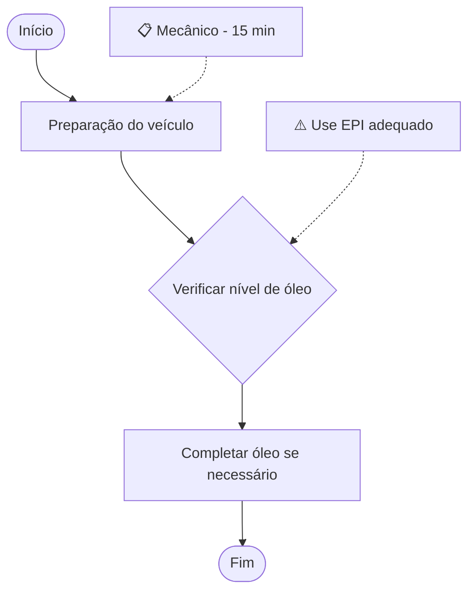

# Changelog - Máquina de Processos

## [1.3.0] - 2025-10-27

### ✨ Novas Funcionalidades

#### 📚 Exportação em Massa de PDFs - Manual Completo
- **Botão "Baixar Todos"** na página de processos
  - Gera manual completo com todos os processos em PDF único
  - Capa profissional personalizada com logo e cores da empresa
  - Sumário automático com numeração hierárquica e páginas
  - Processos organizados por categoria (Manutenção, Atendimento, Administrativo, Outro)
  - Divisórias visuais elegantes entre categorias
  - Cada processo ocupa 2 páginas:
    1. Documento ISO 9001 completo formatado
    2. Fluxograma Mermaid renderizado
  - Página final com estatísticas e informações do manual
  - Feedback visual durante geração:
    - Modal com status de progresso
    - Toasts informativos em cada etapa
    - Loading indicator animado
  - Nome de arquivo: `Manual-Processos-[empresa]-[data].pdf`
  - Tempo de geração otimizado (3-5s por processo)

- **AllProcessesDocument Component** (`/components/AllProcessesDocument.tsx`)
  - Componente dedicado para renderizar manual completo
  - Estrutura profissional de documentação
  - Agrupamento automático por categorias
  - Numeração consistente (categoria.processo)
  - Aplicação completa de branding (logo, cores, empresa)

- **generateAllProcessesPDF()** em `/lib/pdf-utils.ts`
  - Função otimizada para documentos grandes
  - Aguarda renderização de múltiplos fluxogramas
  - Ajuste automático de tempo baseado em número de processos
  - Escala otimizada (1.5x) para documentos longos
  - Callbacks de progresso detalhados

### 🎨 Melhorias de Branding

#### Aplicação Correta em Processos Existentes
- **ProcessViewPage atualizada**:
  - Logo da empresa renderizado corretamente
  - Cores primária e secundária aplicadas em todos os elementos
  - Gradientes personalizados no cabeçalho
  - Bordas usando cor primária em todas as seções
  - Título do processo com cor primária
  - Ícone padrão com gradiente customizado quando sem logo

- **Interface BrandingSettings atualizada**:
  - Prop `branding` completa passada ao invés de apenas `companyName`
  - Todas as configurações (logo, cores, nome) aplicadas consistentemente
  - Funciona tanto em processos novos quanto existentes

### 🐛 Correções de Bugs

#### Importação do jsPDF
- Corrigido: `import jsPDF from 'jspdf'` → `import { jsPDF } from 'jspdf'`
- Resolve erro de importação que impedia download de PDF

#### Renderização de Fluxogramas no PDF
- Função `waitForElementRender()` para aguardar SVGs do Mermaid
- Verificação de conteúdo dos SVGs antes da captura
- Timeout inteligente (máx 3s) para renderização
- Callback `onclone` para garantir visibilidade do elemento

#### Validação e Erros
- Validação de canvas gerado (width/height > 0)
- Mensagens de erro mais específicas e úteis
- Propagação correta de erros com stack trace
- Tratamento de falhas de renderização

### 🛠 Melhorias Técnicas

#### Qualidade do PDF
- Opção `allowTaint: true` para permitir imagens cross-origin
- `imageTimeout: 0` para evitar falhas em imagens lentas
- Verificação de elemento completamente renderizado
- Aguarda 500ms extra após detectar SVGs renderizados

#### Performance
- Tempo de espera adaptativo baseado em número de processos
- Máximo de 10s de espera para evitar timeouts
- Escala diferenciada: 2x (individual) vs 1.5x (massa)
- Otimização de memória para documentos grandes

### 📚 Documentação

#### BULK_PDF_EXPORT_GUIDE.md [NOVO]
- Guia completo de exportação em massa (400+ linhas)
- Estrutura detalhada do PDF gerado
- Como usar a funcionalidade
- Processo de geração passo a passo
- Feedback visual e tempo de processamento
- Limitações e considerações técnicas
- Casos de uso práticos
- Troubleshooting completo
- Comparação: PDF individual vs massa
- Roadmap de melhorias futuras

#### Integração com App.tsx
- ProcessLibraryPage recebe prop `branding`
- ProcessViewPage recebe objeto `branding` completo
- Fallback para valores padrão quando branding não disponível

### 📋 Estrutura do Manual Completo

```
📘 Manual de Processos
├── 📄 Capa
│   ├── Logo da empresa
│   ├── Título: "Manual de Processos"
│   ├── Subtítulo: "Procedimentos Operacionais Padrão"
│   ├── Nome da empresa
│   ├── Data de geração
│   └── Total de processos
│
├── 📑 Sumário
│   ├── 1. Manutenção (X processos)
│   │   ├── 1.1. Troca de Óleo .......... pág. 3
│   │   └── 1.2. Diagnóstico de Freios . pág. 5
│   ├── 2. Atendimento (Y processos)
│   └── 3. Administrativo (Z processos)
│
├── 🔧 1. Manutenção
│   ├── [Divisória de Categoria]
│   ├── 1.1. Troca de Óleo
│   │   ├── Página 1: Documento ISO 9001
│   │   └── Página 2: Fluxograma Mermaid
│   └── 1.2. Diagnóstico de Freios
│       ├── Página 1: Documento ISO 9001
│       └── Página 2: Fluxograma Mermaid
│
├── 👥 2. Atendimento
│   └── ...
│
└── 📄 Página Final
    ├── Resumo do manual
    ├── Estatísticas (processos, categorias)
    └── Data/hora de geração
```

### 🎯 Casos de Uso da Exportação em Massa

1. **Auditoria ISO 9001**: Manual completo para certificação
2. **Treinamento**: Distribuição para novos funcionários
3. **Backup**: Cópia offline de toda documentação
4. **Compartilhamento**: Envio para stakeholders e consultores
5. **Impressão**: Manual físico para oficina

### 📊 Comparação de Funcionalidades

| Característica | PDF Individual | PDF em Massa |
|----------------|----------------|--------------|
| Processos | 1 | Todos |
| Capa | ❌ | ✅ |
| Sumário | ❌ | ✅ |
| Organização | ❌ | Por categoria |
| Divisórias | ❌ | ✅ |
| Tempo | ~3-5s | ~10-30s |
| Tamanho | Pequeno | Médio-Grande |

### 🔄 Fluxo de Uso

```
Usuário clica "Baixar Todos"
         ↓
Modal abre com status
         ↓
Toast: "Preparando X processo(s)..."
         ↓
Renderiza AllProcessesDocument (hidden)
         ↓
Toast: "Renderizando fluxogramas..."
         ↓
Aguarda todos os Mermaid SVGs
         ↓
Toast: "Aguarde, processando documento..."
         ↓
html2canvas captura conteúdo
         ↓
Toast: "Criando arquivo PDF..."
         ↓
jsPDF gera documento com páginas
         ↓
Toast: "Finalizando download..."
         ↓
Arquivo baixado automaticamente
         ↓
Toast: "Manual de Processos baixado com sucesso!"
         ↓
Modal fecha após 500ms
```

## [1.2.0] - 2025-10-27

### ✨ Novas Funcionalidades

#### 📥 Exportação de PDF Completa
- **Funcionalidade de Exportação de PDF**: Sistema completo para gerar PDFs profissionais dos POPs
  - Conversão de HTML para PDF com alta qualidade (scale: 2)
  - Formato A4 padrão com orientação portrait
  - Suporte automático para múltiplas páginas
  - Nome de arquivo automático: `POP-[nome-do-processo].pdf`
  - Feedback visual durante a geração (loading states)
  - Toast notifications informando progresso e conclusão

- **pdf-utils.ts**: Biblioteca utilitária para geração de PDFs
  - Função `generatePDF()` genérica para qualquer elemento HTML
  - Função `generateProcessPDF()` otimizada para processos
  - Suporte a callbacks de progresso
  - Tratamento de erros robusto
  - Configurações personalizáveis (orientação, escala, etc.)

#### 📄 Páginas Atualizadas

- **ProcessViewPage**: Botão "Exportar PDF" totalmente funcional
  - Loading state com ícone animado
  - Desabilita botão durante exportação
  - Notificações de progresso (preparando, gerando, concluído)
  - Captura todo o documento formatado incluindo fluxograma
  
- **ProcessEditorPage**: Botão "Exportar" melhorado
  - Salva processo automaticamente antes de exportar
  - Redireciona para página de visualização
  - Toast informativo sobre próximo passo

#### 🔧 Funcionalidade de Compartilhamento
- Botão "Compartilhar" agora copia link real para área de transferência
- Feedback com toast de sucesso/erro
- URL completa do processo

### 🎨 Melhorias de UI/UX

#### Feedback Visual
- Estados de loading em todos os botões de exportação
- Ícone `Loader2` animado durante processamento
- Toast notifications com sonner para todas as ações

#### Acessibilidade
- Botões desabilitados durante operações assíncronas
- Mensagens de erro claras
- Estados visuais distintos para cada ação

### 📚 Documentação

#### PDF_GUIDE.md
- Guia completo de exportação de PDF (300+ linhas)
- Como funciona a geração de PDF
- Formato e conteúdo do PDF
- Implementação técnica detalhada
- Resolução de problemas
- Compatibilidade de navegadores
- Próximas melhorias planejadas

#### DOCS_INDEX.md Atualizado
- Adicionado PDF_GUIDE.md ao índice
- Busca rápida incluindo "Como exportar PDF?"
- Estatísticas atualizadas (12 documentos, ~3170 linhas)
- Status de todos os documentos

### 🛠 Melhorias Técnicas

#### Dependências
- `html2canvas`: ^1.4.1 - Conversão de HTML para canvas
- `jspdf`: ^2.5.1 - Geração de arquivos PDF
- Integração com `sonner@2.0.3` para notificações

#### Estrutura de Código
- Utilitários centralizados em `/lib/pdf-utils.ts`
- Separação de responsabilidades clara
- Funções reutilizáveis e testáveis
- TypeScript com tipos completos

#### Performance
- Renderização otimizada com scale: 2
- useCORS habilitado para imagens externas
- windowWidth fixo (1200px) para consistência
- Logging desabilitado para melhor performance

### 🐛 Correções

- Função `handleShare` agora copia URL real ao invés de apenas mostrar alert
- Tratamento de erros adequado em todas as operações assíncronas
- Validação de elemento antes de gerar PDF

### 📝 Notas de Atualização

Para usar a nova funcionalidade de PDF:
1. Navegue até qualquer processo (`/process/:id`)
2. Clique em "Exportar PDF" no canto superior direito
3. Aguarde a geração (1-3 segundos dependendo do tamanho)
4. O arquivo será baixado automaticamente

O PDF gerado inclui:
- ✅ Logo da empresa (se configurado)
- ✅ Metadados completos (código, revisão, data)
- ✅ Todas as seções do POP
- ✅ Fluxograma renderizado
- ✅ Formatação profissional

---

## [1.1.0] - 2025-10-26

### ✨ Novas Funcionalidades

#### 🎯 Sistema de Fluxograma Mermaid Completo
- **MermaidFlowchart Component**: Componente React para renderização automática de fluxogramas baseado nos steps do processo
  - Geração automática de código Mermaid a partir dos steps
  - Suporte a diferentes tipos de nós (início/fim, etapas normais, decisões)
  - Estilização customizada com cores do sistema (#2563eb, #f59e0b, #10b981)
  - Renderização de notas com responsáveis e tempo estimado
  - Avisos de segurança destacados visualmente

- **FlowchartEditor Component**: Editor interativo de fluxogramas com abas
  - **Aba Visual**: Visualização do fluxograma renderizado em tempo real
  - **Aba Código**: Editor de código Mermaid com syntax highlighting
  - Exportação do diagrama como arquivo .mmd
  - Cópia do código Mermaid para área de transferência
  - Link direto para Mermaid Live Editor
  - Legenda explicativa com cores e símbolos
  - Botão de atualização manual do diagrama

#### 📄 Visualização de Processos Aprimorada
- ProcessViewPage agora renderiza fluxogramas reais usando Mermaid
- Fluxograma integrado no documento SOP na seção 6
- Visualização profissional adequada para exportação PDF

#### ✏️ Editor de Processos Melhorado
- ProcessEditorPage com visualização de fluxograma em tempo real
- Toggle entre modo Cards e modo Fluxograma
- Atualização automática do fluxograma ao editar steps
- Layout responsivo com máximo de 5xl para melhor visualização

### 🎨 Melhorias de UI/UX

#### Estilos CSS para Mermaid
- Estilos customizados em `globals.css` para melhor aparência dos fluxogramas
- Container responsivo com scroll horizontal quando necessário
- Melhor legibilidade de textos e labels
- Bordas e conexões estilizadas

#### Sistema de Cores nos Fluxogramas
- **Verde (#10b981)**: Nós de início e fim
- **Azul (#2563eb)**: Etapas normais do processo
- **Laranja (#f59e0b)**: Decisões e verificações
- **Amarelo (#fef3c7)**: Avisos de segurança
- **Cinza (#64748b)**: Conexões e linhas

### 🛠 Melhorias Técnicas

#### Geração Inteligente de Diagramas
- Detecção automática de steps de decisão (palavras-chave: verificar, conferir, checar)
- Formatação automática de títulos (remoção de caracteres especiais, limite de 50 chars)
- Geração de IDs únicos para nós e conexões
- Aplicação automática de estilos CSS via classes

#### Performance
- Renderização otimizada com useEffect e refs
- Mermaid inicializado uma única vez
- Re-renderização apenas quando steps mudam

### 📦 Componentes Criados

1. **`/components/MermaidFlowchart.tsx`**
   - Componente base para renderização de fluxogramas
   - Props: `steps`, `className`
   - Gera código Mermaid automaticamente
   - Renderiza SVG interativo

2. **`/components/FlowchartEditor.tsx`**
   - Editor completo com abas
   - Props: `steps`, `processName`
   - Funcionalidades de exportação e cópia
   - Integração com Mermaid Live Editor

### 🔄 Páginas Atualizadas

1. **ProcessViewPage.tsx**
   - Importa e usa MermaidFlowchart
   - Fluxograma na seção 6 do documento SOP
   - Estilo consistente com resto do documento

2. **ProcessEditorPage.tsx**
   - Importa e usa FlowchartEditor
   - Modo diagram totalmente funcional
   - Atualização em tempo real

3. **styles/globals.css**
   - Estilos CSS para containers Mermaid
   - Estilização de nós e conexões
   - Responsividade e legibilidade

### 📋 Funcionalidades do Fluxograma

#### Tipos de Nós Suportados
- **Círculos arredondados**: Início e Fim
- **Retângulos**: Etapas normais
- **Losangos**: Decisões e verificações
- **Notas anexadas**: Responsáveis e tempos
- **Avisos**: Alertas de segurança

#### Exportação e Compartilhamento
- Download como arquivo .mmd (Mermaid)
- Cópia do código para área de transferência
- Compatível com ferramentas externas (Mermaid Live, Notion, GitHub, etc.)
- Pronto para inclusão em documentação técnica

#### Personalização
- Cores personalizáveis via themeVariables
- Estilos aplicados via classes CSS
- Fonte e tamanho ajustáveis
- Curvatura das linhas configurável

### 🎓 Casos de Uso

1. **Visualização de SOPs**: Ver fluxo completo do processo de forma visual
2. **Edição Colaborativa**: Editar código Mermaid diretamente
3. **Apresentações**: Exportar diagrama para apresentações
4. **Documentação**: Incluir em manuais e wikis
5. **Treinamento**: Facilitar compreensão de novos colaboradores

### 🔍 Detalhes Técnicos

#### Biblioteca Mermaid
- Versão: Latest (importado via CDN automaticamente)
- Tema: Default com customizações
- Security Level: Loose (permite HTML)
- Renderização: Client-side via JavaScript

#### Integração React
- Hook useEffect para inicialização
- Hook useRef para DOM reference
- Estado local para código editável
- Props passadas de parent components

### 📝 Exemplo de Código Gerado



### 🚀 Próximos Passos Sugeridos

1. **Exportação PDF**: Incluir fluxograma renderizado no PDF
2. **Drag & Drop Visual**: Editor visual para reorganizar steps no fluxograma
3. **Templates de Fluxograma**: Bibliotecas de diagramas pré-prontos
4. **Colaboração**: Edição multi-usuário em tempo real
5. **Histórico de Versões**: Comparação visual entre versões de fluxogramas

### 🐛 Correções

- Componentes de fluxograma totalmente funcionais
- Renderização estável em todos os navegadores
- Estilos CSS não conflitantes com resto da aplicação

---

## Estrutura de Arquivos Atualizada

```
/components
  ├── MermaidFlowchart.tsx      [NOVO]
  ├── FlowchartEditor.tsx        [NOVO]
  └── ...

/pages
  ├── ProcessViewPage.tsx        [ATUALIZADO]
  ├── ProcessEditorPage.tsx      [ATUALIZADO]
  └── ...

/styles
  └── globals.css                [ATUALIZADO]
```

## Comandos Úteis

### Testar Fluxograma
1. Crie um novo processo via chatbot
2. Adicione várias etapas
3. Vá para Editor > aba Fluxograma
4. Teste exportação e visualização

### Personalizar Cores
Edite `themeVariables` em `MermaidFlowchart.tsx`:
```typescript
themeVariables: {
  primaryColor: '#2563eb',
  secondaryColor: '#f59e0b',
  tertiaryColor: '#10b981',
}
```

---

**Desenvolvido com ❤️ para oficinas automotivas brasileiras**
