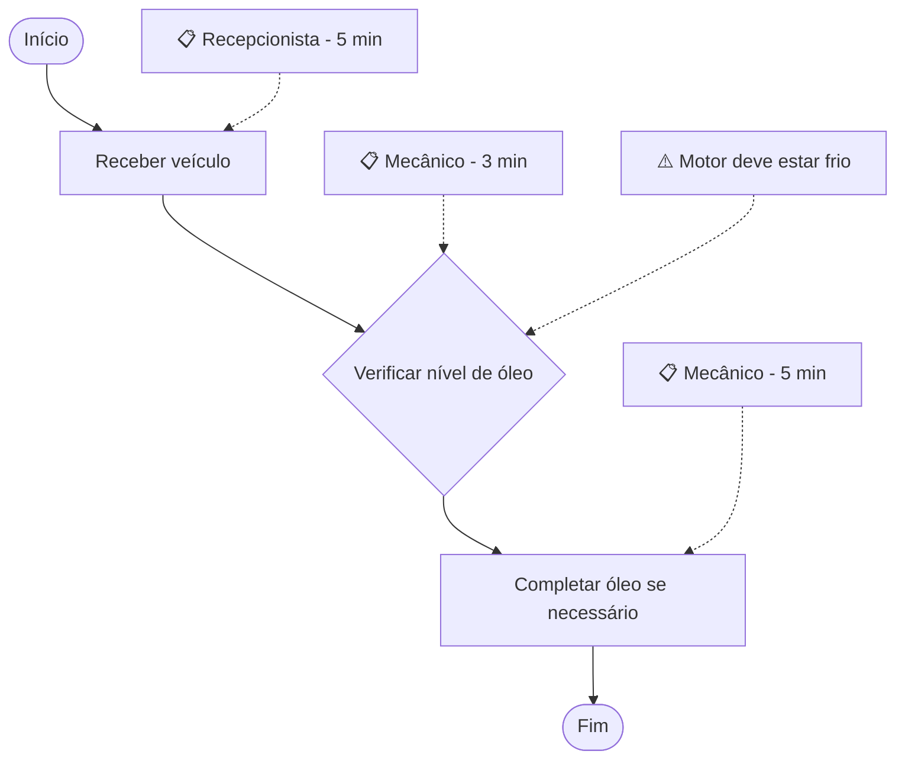
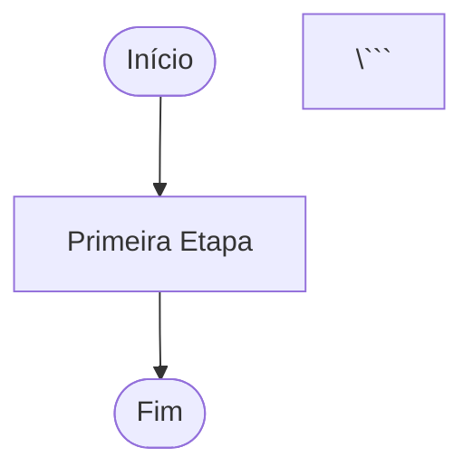

# 📊 Guia Completo do Sistema de Fluxogramas

## Visão Geral

O Máquina de Processos agora possui um sistema completo de geração e edição de fluxogramas usando a biblioteca Mermaid. Este sistema permite que você visualize seus SOPs de forma gráfica, facilitando o entendimento e a comunicação dos processos.

## 🎯 Funcionalidades Principais

### 1. Geração Automática
- Fluxogramas são gerados automaticamente a partir dos steps do processo
- Cada step se torna um nó no diagrama
- Conexões são criadas automaticamente seguindo a ordem

### 2. Tipos de Nós Inteligentes
O sistema detecta automaticamente o tipo de cada step:

- **Início/Fim** (Verde): Nós de entrada e saída do processo
- **Etapa Normal** (Azul): Steps regulares do processo
- **Decisão** (Laranja): Steps com palavras-chave de decisão
  - Exemplos: "Verificar", "Conferir", "Checar", "Inspecionar"
- **Avisos** (Amarelo): Alertas de segurança anexados aos steps

### 3. Metadados Visuais
- **📋 Notas**: Mostram responsável e tempo estimado
- **⚠️ Avisos**: Destacam requisitos de segurança
- **Conexões**: Linhas que mostram o fluxo do processo

## 📦 Componentes

### MermaidFlowchart

Componente base para renderização de fluxogramas.

**Uso:**
```tsx
import { MermaidFlowchart } from './components/MermaidFlowchart';

<MermaidFlowchart 
  steps={process.steps} 
  className="custom-class"
/>
```

**Props:**
- `steps`: Array de ProcessStep
- `className`: Classes CSS adicionais (opcional)

**Recursos:**
- Renderização SVG interativa
- Responsivo e scrollável
- Cores personalizadas
- Estilos via CSS

### FlowchartEditor

Editor completo com visualização e edição de código.

**Uso:**
```tsx
import { FlowchartEditor } from './components/FlowchartEditor';

<FlowchartEditor 
  steps={process.steps}
  processName={process.name}
/>
```

**Props:**
- `steps`: Array de ProcessStep
- `processName`: Nome do processo

**Recursos:**
- Abas Visual/Código
- Exportação .mmd
- Cópia para clipboard
- Link para Mermaid Live Editor
- Atualização manual
- Legenda explicativa

## 🎨 Esquema de Cores

```css
/* Verde - Início/Fim */
fill: #10b981
stroke: #059669

/* Azul - Etapas Normais */
fill: #2563eb
stroke: #1d4ed8

/* Laranja - Decisões */
fill: #f59e0b
stroke: #d97706

/* Cinza Claro - Notas */
fill: #f1f5f9
stroke: #cbd5e1

/* Amarelo - Avisos */
fill: #fef3c7
stroke: #f59e0b
```

## 🔧 Como Funciona

### 1. Detecção de Tipos de Nó

```typescript
// Step com warning -> Losango
if (step.warning) {
  diagram += `${currentStep}{${stepTitle}}\n`;
}

// Step com palavra-chave -> Losango
else if (step.title.includes('verificar')) {
  diagram += `${currentStep}{${stepTitle}}\n`;
}

// Step normal -> Retângulo
else {
  diagram += `${currentStep}[${stepTitle}]\n`;
}
```

### 2. Geração de Metadados

```typescript
// Adiciona nota com responsável e tempo
if (step.responsible || step.duration) {
  const noteId = `Note${index + 1}`;
  let noteText = '';
  if (step.responsible) noteText += step.responsible;
  if (step.duration) noteText += ` - ${step.duration}`;
  diagram += `${noteId}["📋 ${noteText}"]\n`;
  diagram += `${noteId} -.-> ${currentStep}\n\n`;
}
```

### 3. Aplicação de Estilos

```typescript
// Define classes CSS
diagram += 'classDef startEnd fill:#10b981,...\n';
diagram += 'classDef normalStep fill:#2563eb,...\n';
diagram += 'classDef decisionStep fill:#f59e0b,...\n';

// Aplica classes aos nós
diagram += 'class Start,End startEnd\n';
diagram += `class ${normalSteps} normalStep\n`;
diagram += `class ${decisionSteps} decisionStep\n`;
```

## 📝 Exemplo Prático

### Input (Process Steps):
```typescript
[
  {
    id: '1',
    title: 'Receber veículo',
    description: 'Cliente chega com veículo',
    responsible: 'Recepcionista',
    duration: '5 min',
    order: 1
  },
  {
    id: '2',
    title: 'Verificar nível de óleo',
    description: 'Conferir nível no painel',
    warning: 'Motor deve estar frio',
    responsible: 'Mecânico',
    duration: '3 min',
    order: 2
  },
  {
    id: '3',
    title: 'Completar óleo se necessário',
    description: 'Adicionar óleo adequado',
    responsible: 'Mecânico',
    duration: '5 min',
    order: 3
  }
]
```

### Output (Mermaid Diagram):


## 🚀 Casos de Uso

### 1. Visualização Rápida
```tsx
// Na página de visualização
<section>
  <h3>Fluxograma do Processo</h3>
  <MermaidFlowchart steps={process.steps} />
</section>
```

### 2. Edição Interativa
```tsx
// Na página de edição
<FlowchartEditor 
  steps={editedProcess.steps}
  processName={editedProcess.name}
/>
```

### 3. Exportação
```typescript
// Exportar como .mmd
const handleExport = () => {
  const code = generateMermaidCode();
  const blob = new Blob([code], { type: 'text/plain' });
  const url = URL.createObjectURL(blob);
  const a = document.createElement('a');
  a.href = url;
  a.download = `${processName}.mmd`;
  a.click();
};
```

## 🎓 Melhores Práticas

### 1. Títulos de Steps
- **Bom**: "Verificar pressão dos pneus"
- **Evite**: "Pneus - verificação de pressão (importante!!!)"
- Motivo: Títulos curtos e claros ficam melhores no diagrama

### 2. Palavras-chave para Decisões
Use verbos que indicam decisão:
- ✅ Verificar
- ✅ Conferir
- ✅ Checar
- ✅ Inspecionar
- ✅ Validar

### 3. Avisos de Segurança
- Seja conciso (máximo 40 caracteres)
- Use linguagem clara
- Foque no mais importante

### 4. Responsáveis e Tempos
- Especifique sempre que possível
- Use tempos realistas
- Indique cargo/função, não nome

## 🔄 Integrações

### Mermaid Live Editor
O código gerado é 100% compatível com [Mermaid Live](https://mermaid.live):

1. Copie o código na aba "Código"
2. Cole no Mermaid Live Editor
3. Edite visualmente
4. Exporte como PNG/SVG

### GitHub/GitLab
Diagrams podem ser incluídos em READMEs:

```markdown


### Notion
1. Copie o código Mermaid
2. Cole em um bloco de código no Notion
3. Selecione linguagem "Mermaid"
4. Diagrama renderiza automaticamente

### Documentação Técnica
- Confluence
- Wiki.js
- Docusaurus
- MkDocs

## 🛠 Personalização Avançada

### Mudar Tema de Cores

Edite em `MermaidFlowchart.tsx`:

```typescript
themeVariables: {
  primaryColor: '#FF6B6B',      // Vermelho
  secondaryColor: '#4ECDC4',    // Turquesa
  tertiaryColor: '#45B7D1',     // Azul claro
  lineColor: '#95A5A6',         // Cinza
  fontSize: '18px',             // Maior
}
```

### Adicionar Novos Tipos de Nó

```typescript
// Detectar tipo especial
if (step.title.toLowerCase().includes('aprovar')) {
  diagram += `${currentStep}{{${stepTitle}}}\n`;  // Hexágono
}
```

### Customizar Conexões

```typescript
// Conexão com label
diagram += `${currentStep} -->|Sim| ${nextStep}\n`;

// Conexão pontilhada
diagram += `${currentStep} -.-> ${nextStep}\n`;

// Conexão grossa
diagram += `${currentStep} ==> ${nextStep}\n`;
```

## 📊 Estatísticas do Sistema

- **Tempo de renderização**: ~200-500ms para 10 steps
- **Tamanho médio do código**: 1-2KB por processo
- **Compatibilidade**: Todos os navegadores modernos
- **Performance**: Otimizado para até 50 steps

## 🐛 Troubleshooting

### Diagrama não aparece
1. Verifique se há steps no processo
2. Confira o console do navegador
3. Valide o código no Mermaid Live

### Nós sobrepostos
- Reduza tamanho dos títulos
- Use quebras de linha no código
- Ajuste padding nas configurações

### Cores não aplicadas
- Verifique se classes CSS estão definidas
- Confirme que estilos não estão sendo sobrescritos
- Limpe cache do navegador

## 📚 Recursos Adicionais

- [Documentação Mermaid](https://mermaid.js.org/)
- [Mermaid Live Editor](https://mermaid.live)
- [Exemplos de Diagramas](https://mermaid.js.org/syntax/flowchart.html)
- [Galeria de Fluxogramas](https://github.com/mermaid-js/mermaid/tree/develop/demos)

## 🎯 Roadmap Futuro

- [ ] Editor visual drag-and-drop
- [ ] Mais tipos de diagramas (sequência, Gantt, etc.)
- [ ] Exportação como PNG/SVG
- [ ] Templates de fluxogramas prontos
- [ ] Colaboração em tempo real
- [ ] Histórico visual de versões
- [ ] Análise de complexidade do processo
- [ ] Sugestões automáticas de otimização

---

**Desenvolvido para facilitar a documentação de processos em oficinas automotivas brasileiras** 🇧🇷
